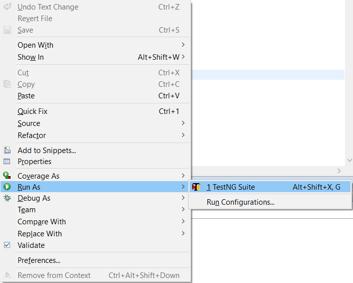
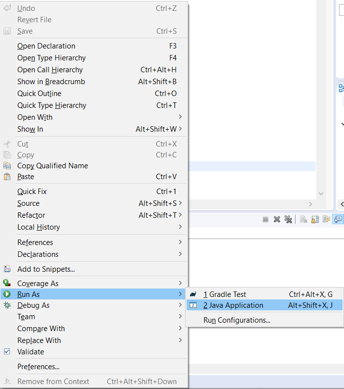
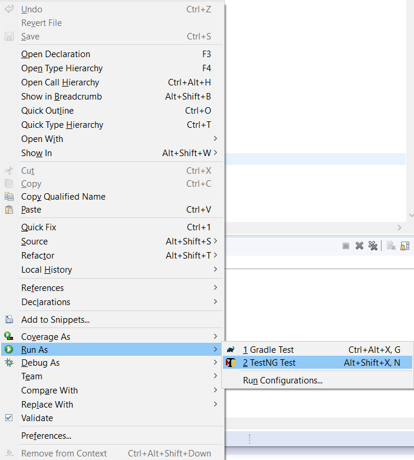

# UserInterfaceTesting.Framework.Puma 
This is a User Interface testing Framework using Java, Gradle, TestNG and Selenium WebDriver to test UltimateQA Practice site.

## Selenium WebDriver 
Selenium WebDriver is a collection of open source APIs which are used to automate the testing of a web application. Selenium WebDriver tool is used to automate web application testing to verify that it works as expected. It supports many browsers such as Firefox, Chrome, IE, and Safari. WebDriver is a web automation framework that allows you to execute your tests against different browsers. It also enables you to use a programming language in creating your test scripts. https://www.seleniumhq.org/projects/webdriver/

## Project Natures

### Gradle 
Gradle is an open-source build automation system that builds upon the concepts of Apache Ant and Apache Maven and introduces a Groovy-based domain-specific language (DSL) instead of the XML form used by Apache Maven for declaring the project configuration.[2] Gradle uses a directed acyclic graph ("DAG") to determine the order in which tasks can be run.
https://gradle.org/

### TestNG 
TestNG is a testing framework for the Java programming language inspired by JUnit and NUnit. The design goal of TestNG is to cover a wider range of test categories: unit, functional, end-to-end, integration, etc., with more powerful and easy-to-use functionalities.
https://testng.org/doc/

## UltimateQA Practice site 
A free place to practice some scenarios like:
* Testing a large complicated page
* Work with simple HTML elements like buttons
* Fill out forms
* Automate an application that evolves over time

https://www.ultimateqa.com/automation/

## Integrated Development Environment
Eclipse IDE is used to develop this Framework.

### Run Tests
There are three ways of running test cases of this project:

#### Using testngrunall.xml
* Open file in Eclipse: ..\UserInterfaceTesting.Framework.Puma\testngrunall.xml
* Right click => Run As
* TestNG Suite

#### Using TestNGRunner.java
* Open file in Eclipse: ..\UserInterfaceTesting.Framework.Puma\src\test\java\runner\TestNGRunner.java
* Right click => Run As
* Java Application

#### Using TestNGFactory.java
* Open file in Eclipse: ..\UserInterfaceTesting.Framework.Puma\src\test\java\factory\TestNGFactory.java
* Right click => Run As
* TestNG Test

#### TestNG Eclipse plug-in
The TestNG Eclipse plug-in allows you to run your TestNG tests from Eclipse and easily monitor their execution and their output.
https://testng.org/doc/eclipse.html
